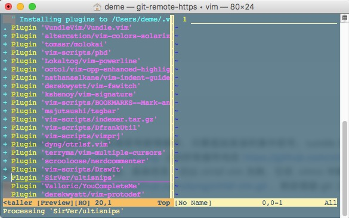

# fancy-vim
定制属于你自己的Vim - 没有做不到的功能，只有你想不到的Vim   

**跟着大神学vim** [所需即所获：像 IDE 一样使用 vim](https://github.com/yangyangwithgnu/use_vim_as_ide)

## Elementary knowledge

**注释** `"` 单个双引号为注释标记    

**插件分类** vim插件分为`*.vim` `*.vba`, **前者** 是传统格式的文本文件，通常`someplugin.vim`(插件脚本) + `someplugin.txt`(帮助文档) 打包到一个文件中，解压后`someplugin.vim` 拷贝到 `~/.vim/plugin/` 目录,`someplugin.txt` 拷贝到 `~/.vim/doc/` 目录并`重启`即可；
但帮助文件需执行 `:helptags ~/.vim/doc/` 才能生效，可通过 `:h someplugin` 查看插件帮助信息。 **后者** 通过命令安装,like so:

```shell
vim someplugin.vba
:so %
:q
```

**插件管理工具** `vundle`

**`.vimrc`** vim配置文件,位于`~/.vimrc`,可以设置软链到其他目录下...

**`~/.vim/`** .vim/目录是存放插件的地方...

## Install & Configuration

### Upgrade vim

*make* 编译和安装项目的命令

*由于预安装的vim很多功能没有，so upgrade it,important！！！* 

**Config on Mac** Mac 默认支持很多语言如ruby python,我按照原文安装 **not work** so:

```shell
brew install vim --override-system-vi
```

### Install vundle

**清空`.vim/`** 目录

```shell
git clone https://github.com/VundleVim/Vundle.vim.git ~/.vim/bundle/Vundle.vim
```

### Config .vimrc

省略查看`.vimrc`文件

#### Enter vim mode & Install Plugins



```shell
vim

:PluginInstall
```

#### Remove Plugins

在`.vimrc`文件中注释或删除插件信息,and then:

```shell
vim

:PluginClean
```

#### Upgrade Plugins

**批量更新**
```shell
vim

:PluginUpdate
```

## Commonly used commands of vim

### vim的[`四种模式`](http://www.cnblogs.com/zeushuang/archive/2012/11/16/2772830.html)

- `normal` 普通模式  
   进入vim时显示的模式，显示`normal`字样，主要浏览和删除文本内容
- `insert` 输入模式  
   按`i` `o`进入的模式，显示`insert`字样,主要用来增加内容，`i`会在当前位置前插入，`o`会在当下一行插入
- `visual` 可视模式  
   按`v` 进入的`逐字`模式，显示`visual`字样,主要用来选取（复制）内容,`V`进入为`逐行`选取模式
- `command` 命令模式  
   命令模式，主要输入命令，操作文件等

### 历史命名

以`:` 和 `/`开头的命令都有历史纪录，可以首先键入:或/然后按上下箭头来选择某个历史命令

### vim启动命令

`vim`:启动vim   

### 文件命令

`vim file ...`: 打开文件，没有则创建并打开   
`:open file`:vim中打开文件   
`:split file`:在新窗口中打开文件   

### 插入命令

`i`:当前位置`前`插入   
`I`:当前`行首`插入    

`a`:当前位置`后`插入   
`A`:当前`行尾`插入   

`o`:当前`行后`插入`一行`    
`O`:当前`行前`插入`一行`    

### 查找命令

`/keyword`:搜索关键字回车后，`n`向后查找,`N`向前查找    

### 移动命令

_尼玛，奇葩的命令，点不好记_

`h`:左移一个`字符`(head)    
`l`:右移一个字符    
`k`:上移一个字符    
`j`:下移一个字符    

`w`:`右`移一个`单词`    
`b`:`左`移一个单词    

`0`:(零)移到`行首`    
`$`:移到`行尾`    

`gg`:移到文件`头部`    
`G`:移到文件`尾部`    

### 撤销和重做

`u`:撤销一步(undo)    
`U`:撤销整行(undo)    
`Ctrl + r`:重做(redo)    

### 删除

`x` `dl`:删除当前字符(delete)    
`dh`:删除前一个字符(delete ahead)    
`dd`:删除当前行    

## 拷贝和粘贴

`yy`:拷贝当前行,`**n**yy`可复制当前行为开始的`n`行数据      
`p`:粘贴(paste),如果是通过`yy`命令复制的内容将在下一行粘贴      
`ddp`:交换当前行与下一行位置

* 可视模式`visual`下，只要选取内容，并输入`y`即可复制

### Reference

[Vim常用命令](http://www.cnblogs.com/softwaretesting/archive/2011/07/12/2104435.html)    
[vim map nmap](http://www.cnblogs.com/lq0729/archive/2011/12/24/2300189.html)   
